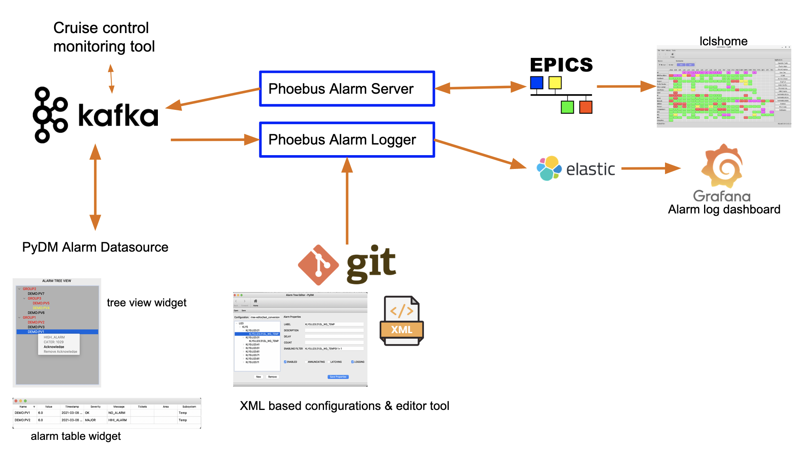

# Components

The NALMS alarm system is heavily modularized and consists of:

* Zookeeper for Kafka  orchestration
* Kafka brokers for robust state management
* Cruise control for Kafka cluster administration
* Phoebus alarm server for the translation of EPICS alarm events into Kafka messages
* Phoebus alarm logger for the translation of Kafka messages into Elasticsearch documents
* A Grafana log dashboard for Elasticsearch integration
* PyDM tools for GUI integration
* AlarmIOC for exposure of alarm state to control system

Due to this modularization, the system is easily extensible and all alarm state, configuration actions, and alarm actions are exposed over the Elasticsearch server API or via a Kafka consumer, easily integrable with applications beyond the scope of this project.

